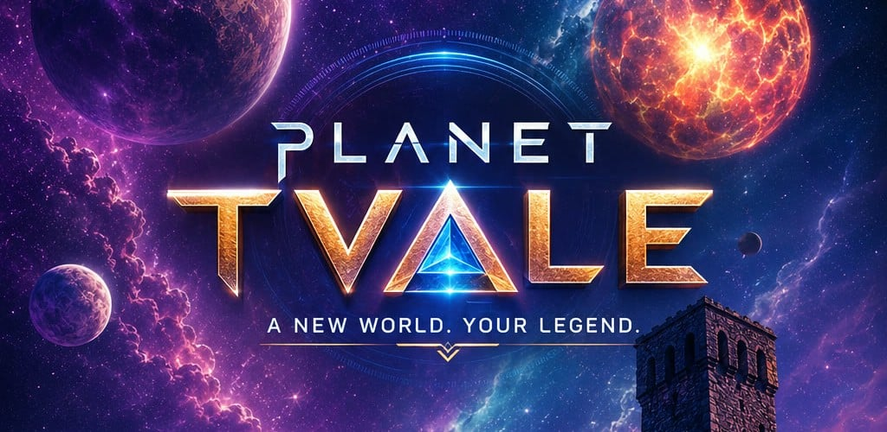

I build AI-powered pipelines, business intelligence systems, and cross-platform
products — production software deployed for real clients and real users.

**[Tech Stack](#tech-stack) · [Projects](#projects) · [GitHub Activity](#github-activity) · [Connect](#connect)**

---

## Tech Stack

---

## Projects

### 🎮 [Planet Tvale — Georgian Alphabet Game](https://github.com/Knight-Panther/space-counter)

A 2D arcade shooter that teaches kids the Georgian alphabet (33 letters) and
numbers 1–20 — shoot the falling alien with the correct letter to advance
through waves and boss battles. Built solo end-to-end on Phaser 4 (latest
engine release), packaged as a native Android app via Capacitor, currently in
closed testing on Google Play.

Fully automated release pipeline: GitHub Actions builds, signs, and ships the
web build to GitHub Pages and a signed Android App Bundle to Google Play on
every tagged release — no manual build steps.

**Stack:** `Phaser 4 · TypeScript · Vite · Capacitor (Android) · GitHub Actions CI/CD`

[Play in browser →](https://knight-panther.github.io/space-counter/) · [View repository →](https://github.com/Knight-Panther/space-counter)

---

### 🗼 [Telo Watch Tower](https://github.com/Knight-Panther/Telo-watch-tower)

AI media monitoring pipeline. Ingests 500+ RSS sources, deduplicates semantically with pgvector, scores with Claude/OpenAI/DeepSeek, translates to Georgian, generates AI news card images, and delivers curated briefings to Telegram, Facebook, and LinkedIn.

**7-stage pipeline:** `INGEST → DEDUP → PRE-FILTER → LLM SCORE → TRANSLATE → IMAGE GEN → DISTRIBUTE`

[View repository →](https://github.com/Knight-Panther/Telo-watch-tower)

---

### 📍 [Telo Business Directory](https://github.com/Knight-Panther/Telo-Business-Directory)

Bilingual Georgian/English local business directory live at [telo.ge](https://www.telo.ge). Users search and browse 350+ businesses by category, city, and keyword. Includes user accounts, Google OAuth, reviews, business submissions with admin moderation, and ImageKit CDN for optimized images.

**Stack:** `React 19 · Express 5 · MongoDB Atlas · JWT Auth · i18next (ka/en) · Koyeb · Cloudflare`

[View repository →](https://github.com/Knight-Panther/Telo-Business-Directory)

---

## GitHub Activity

---

## Connect

