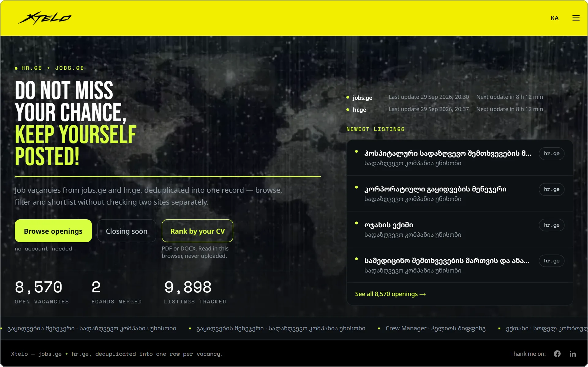
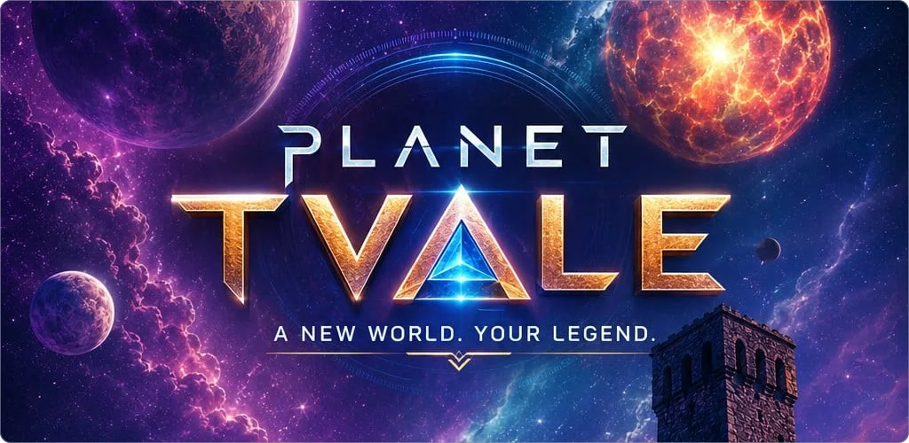

<picture>
  <source media="(prefers-color-scheme: dark)" srcset="assets/banner-dark.webp">
  
</picture>

I'm a developer in Tbilisi. I build products for people in Georgia end to end: the crawler or AI pipeline behind them, the database, the interface, and the server they run on. Everything below is live or shipping.

## Projects

### [Xtelo](https://jobster.fun)

Every vacancy from jobs.ge and hr.ge in one list, matched to your CV without the CV leaving your device.

- **One list, no duplicates.** It crawls both boards every day, with their permission, and merges a vacancy posted on both into one row: 8,570 open vacancies from 9,898 postings.
- **CV matching that stays in the browser.** Drop in a PDF or DOCX in English or Georgian, and the page reads it and ranks the vacancies on your own device. Nothing is uploaded, and every match shows why it matched.
- **Run like a real service.** The public site, the admin and the operator tools come from one Next.js codebase, on PostgreSQL with least-privilege roles, a strict content security policy, nightly off-site backups and end-to-end tests in Playwright.

Built with TypeScript, Next.js, PostgreSQL, Drizzle, Transformers.js, Playwright, Caddy, Cloudflare

**[Open jobster.fun](https://jobster.fun)** &emsp; [Source code](https://github.com/Knight-Panther/scraplify)

### [Planet Tvale](https://knight-panther.github.io/space-counter/)

An arcade game that teaches children the 33 letters of the Georgian alphabet and the numbers 1 to 20.

Shoot the alien carrying the right letter to clear each wave and beat the boss. I built it alone on Phaser 4 and ship it as an Android app with Capacitor; it is in closed testing on Google Play. Every tagged release builds, signs and publishes itself: the web version to GitHub Pages and a signed app bundle to Google Play.

Built with Phaser 4, TypeScript, Vite, Capacitor, GitHub Actions

**[Play in the browser](https://knight-panther.github.io/space-counter/)** &emsp; [Source code](https://github.com/Knight-Panther/space-counter)

### [Telo Watch Tower](https://github.com/Knight-Panther/Telo-watch-tower)

AI media monitoring that turns 500+ RSS sources into curated news briefings in Georgian.

Each article is ingested, deduplicated by meaning with pgvector, pre-filtered, scored by an LLM (Claude, OpenAI or DeepSeek), translated into Georgian, given a generated news-card image, and published to Telegram, Facebook and LinkedIn.

Built with TypeScript, Fastify, React, PostgreSQL with pgvector, Redis and BullMQ, Docker, Turborepo

**[Source code](https://github.com/Knight-Panther/Telo-watch-tower)**

### [Telo](https://www.telo.ge)

A directory of renovation businesses in Georgia, in Georgian and English.

People search and filter 358 businesses by category, service area and type, sign in with Google to leave reviews, and submit their own business for moderation. Images are served through ImageKit's CDN.

Built with React 19, Express 5, MongoDB Atlas, i18next, ImageKit, Koyeb, Cloudflare

**[Open telo.ge](https://www.telo.ge)** &emsp; [Source code](https://github.com/Knight-Panther/Telo-Business-Directory)

## Tools I use

| Area | Tools |
| :--- | :--- |
| Languages | TypeScript, JavaScript, SQL |
| Back end | Node.js, Fastify, Express, PostgreSQL and pgvector, MongoDB, Redis and BullMQ |
| Front end | React, Next.js, Tailwind CSS, Phaser |
| AI | Claude, OpenAI and DeepSeek APIs, embeddings, models that run in the browser |
| Shipping | Docker, GitHub Actions, Linux servers with systemd and Caddy, Cloudflare |

## Contact

The quickest way to reach me is [LinkedIn](https://www.linkedin.com/in/giorgi-teliashvili-77b47935b/).
